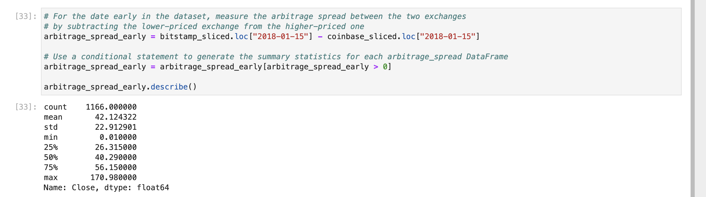

# Crypto_Arbitrage

This project explores arbitrage opportunites in Bitcoin as it trades across various markets around the globe. The historical data used in this arbitrage analysis will come from two separate exchanges: Coinbase and Bitstamp. Python and Pandas will be used to analyze the datasets through summary statistics visulizations and a time series analysis. Those tools will be used to gain a deeper analysis of the datasets and find arbitrage opportunites by focusing on various time periods in the datasets. 

---

## Technologies

This project leverages python 3.7 with the following packages:

* [pandas](https://pandas.pydata.org/docs/getting_started/install.html) - For summary statistics, visulizations, and times series analysis.
* [matplotlib inline](https://matplotlib.org/stable/users/installing/index.html) - Matplotlib is a comprehensive library for creating static, animated, and interactive visualizations in Python. 
* [jupyter lab](https://jupyter.org/install) - JupyterLab is the latest web-based interactive development environment for notebooks, code, and data.

* Visual Studio Code Version: 1.70.2 (Universal)
Commit: e4503b30fc78200f846c62cf8091b76ff5547662
Date: 2022-08-16T05:36:37.829Z
Electron: 18.3.5
Chromium: 100.0.4896.160
Node.js: 16.13.2
V8: 10.0.139.17-electron.0
OS: Darwin arm64 21.4.0

---

## Installation Guide

Before running the application first install the following dependencies.

```python
import pandas as pd
from pathlib import path
%matplotlib inline
```

## Overall Analysis

The datasets for Bitcoin covered the time period 01 Jan 2018 - 01 Apr 2018. The analysis showed that best arbitrage opportunities over the time period was greatest during early January through mid February. During that time the chart showed the greatest volatility. As the dataset approached March and April the arbitrage opportunities between both exchanges began to decreased as the price volatility started to align. 

---
## Focused Analysis

The Bitcoin datasets for Coinbase and Bitstamp ranged from Jan - 31 Mar 2018. Theses datasets were overlayed with one another and then a time series analysis was performed covering three different dates across the merged datasets to calculate arbitrage opportunites and profits.


15 JAN 2018





## Contributors

Antiwan Maxwell

---

## License

MIT
